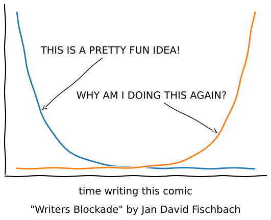

# skill-challenge Jan David Fischbach

<!-- WARNING: THIS FILE WAS AUTOGENERATED! DO NOT EDIT! -->

Hey everyone, my name is **Jan David Fischbach**. I have studied
electrical engineering 💡 at *RWTH University*, where I graduated with a
master’s degree in 2022 🎓.

I made my first contact with photonics during a voluntary internship at
TU Vienna during my second semester, where I had the pleasure to witness
a mind-blowing 💥 presentation by *Jelena Vuckovic* on inverse photonic
design. Ever since I was determined to go down that very rabbit hole.
Starting off with the conventional intuition-driven design of
fabrication robust passive devices in my bachelor’s thesis, and
subsequent work at the Institute for Integrated Photonics (*IPH*) 🥼. At
IPH I also spend some time in their cleanroom facilities dedicated to
PIC fabrication 🛠️. In my masters, I started working on active graphene
photonic devices (theoretically and practically), in particular,
(resonant) graphene modulators in a collaboration between *Black
Semiconductor GmbH* and the Center for Applied Micro- and
Optoelectronics (*AMO*) 🔦.

That is where I first came in contact with `gdsfactory`. I see the
openness of `gdsfactory` as a blessing to the photonics community, as
only such transparency opens up an environment in which concrete and
reliable progress can be made jointly. In the long run, I am in pursuit
of such an open and enabling environment for all areas of integrated
photonics in academia and industry. With photonics, we have a very
potent toolbox 🧰 capable to tackle a wide variety of relevant problems
(communication 🛰️, sensing 🧬, compute 💿, etc.). However, I believe we
can only make full use of its potential as a collaborative community 🤝.

I have been working at Black Semiconductor and since Feburary traveling
after graduation. It’s about time to get my hands dirty again! I am
planning to start a PhD this summer/fall. Where is yet to be determined.

``` python
import matplotlib.pyplot as plt
import numpy as np

import logging
logging.getLogger('matplotlib.font_manager').setLevel(logging.ERROR)

plt.xkcd()

fig = plt.figure()
ax = fig.add_axes((0.1, 0.2, 0.8, 0.7))
ax.spines[['top', 'right']].set_visible(False)
ax.set_xticks([])
ax.set_yticks([])

t = np.linspace(0, 10)
plt.plot(t, np.exp(10-t))
plt.plot(t, np.exp(t))

p_l = 1
p_r = 8.5

ax.annotate(
        "THIS IS A PRETTY FUN IDEA!",
        xy=(p_l, np.exp(10-p_l)), arrowprops=dict(arrowstyle='->'), xytext=(p_l, 2*np.exp(10-p_l)))

ax.annotate(
        'WHY AM I DOING THIS AGAIN?',
        xy=(p_r, np.exp(p_r)), arrowprops=dict(arrowstyle='->'), xytext=(2.5, 2*np.exp(p_r)))

ax.set_xlabel('time writing this comic', labelpad=15)

fig.text(
        0.5, 0.05,
        '"Writers Blockade" by Jan David Fischbach',
        ha='center')
```

    Text(0.5, 0.05, '"Writers Blockade" by Jan David Fischbach')



    : 
